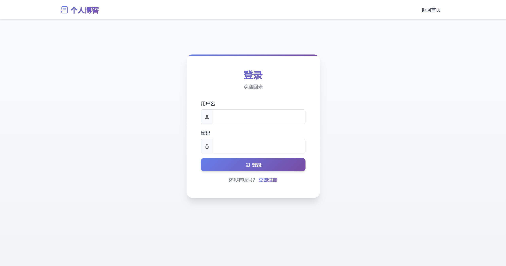
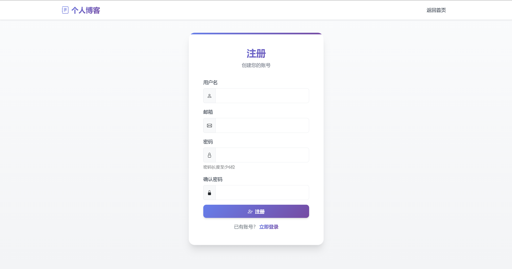
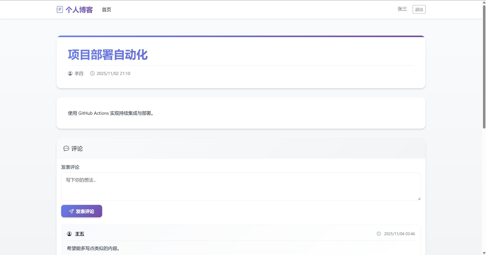
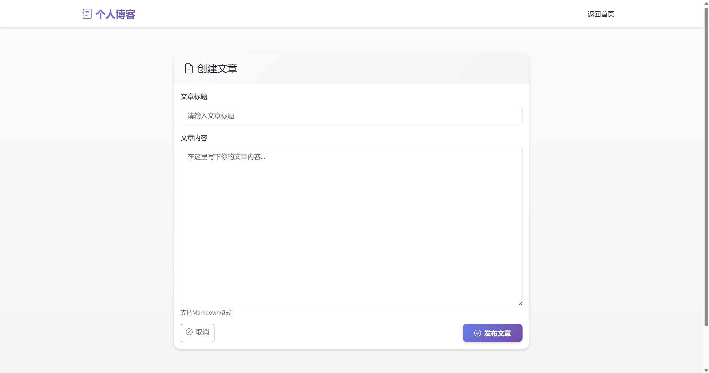
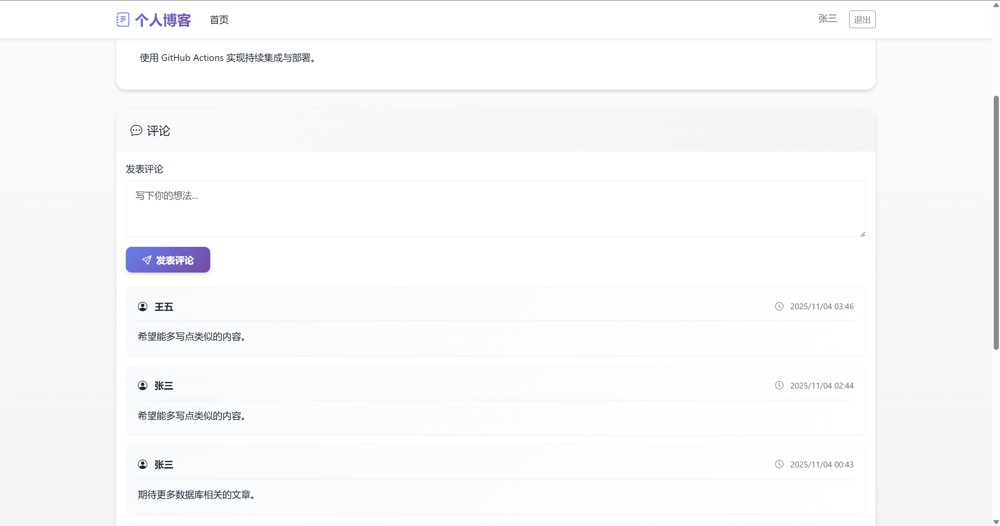

# 个人博客系统

一个基于 Go + Gin + GORM 开发的个人博客系统，支持用户认证、文章管理和评论功能。

## 📋 目录

- [项目简介](#项目简介)
- [作业要求](#作业要求)
- [技术栈](#技术栈)
- [项目结构](#项目结构)
- [功能特性](#功能特性)
- [API 接口文档](#api-接口文档)
- [安装与运行](#安装与运行)
- [数据库设计](#数据库设计)
- [开发说明](#开发说明)
- [页面预览](#页面预览)

---

## 项目简介

本项目是一个前后端分离的个人博客系统，后端使用 Go 语言结合 Gin 框架和 GORM 库开发，前端使用 HTML + CSS + JavaScript + Bootstrap 5 构建。系统实现了完整的用户认证、文章管理和评论功能。

---

## 作业要求

### 总体要求

使用 Go 语言结合 Gin 框架和 GORM 库开发一个个人博客系统的后端，实现博客文章的基本管理功能，包括文章的创建、读取、更新和删除（CRUD）操作，同时支持用户认证和简单的评论功能。

### 详细要求

#### 1. 项目初始化
- 创建一个新的 Go 项目，使用 `go mod init` 初始化项目依赖管理
- 安装必要的库，如 Gin 框架、GORM 以及数据库驱动（如 MySQL 或 SQLite）

#### 2. 数据库设计与模型定义
- 设计数据库表结构，至少包含以下几个表：
  - **users 表**：存储用户信息，包括 `id`、`username`、`password`、`email` 等字段
  - **posts 表**：存储博客文章信息，包括 `id`、`title`、`content`、`user_id`（关联 users 表的 id）、`created_at`、`updated_at` 等字段
  - **comments 表**：存储文章评论信息，包括 `id`、`content`、`user_id`（关联 users 表的 id）、`post_id`（关联 posts 表的 id）、`created_at` 等字段
- 使用 GORM 定义对应的 Go 模型结构体

#### 3. 用户认证与授权
- 实现用户注册和登录功能，用户注册时需要对密码进行加密存储，登录时验证用户输入的用户名和密码
- 使用 JWT（JSON Web Token）实现用户认证和授权，用户登录成功后返回一个 JWT，后续的需要认证的接口需要验证该 JWT 的有效性

#### 4. 文章管理功能
- 实现文章的创建功能，只有已认证的用户才能创建文章，创建文章时需要提供文章的标题和内容
- 实现文章的读取功能，支持获取所有文章列表和单个文章的详细信息
- 实现文章的更新功能，只有文章的作者才能更新自己的文章
- 实现文章的删除功能，只有文章的作者才能删除自己的文章

#### 5. 评论功能
- 实现评论的创建功能，已认证的用户可以对文章发表评论
- 实现评论的读取功能，支持获取某篇文章的所有评论列表

#### 6. 错误处理与日志记录
- 对可能出现的错误进行统一处理，如数据库连接错误、用户认证失败、文章或评论不存在等，返回合适的 HTTP 状态码和错误信息
- 使用日志库记录系统的运行信息和错误信息，方便后续的调试和维护

---

## 技术栈

### 后端
- **Go 1.21+** - 编程语言
- **Gin** - Web 框架
- **GORM** - ORM 库
- **JWT** - 身份认证
- **bcrypt** - 密码加密
- **MySQL/SQLite** - 数据库

### 前端
- **HTML5** - 页面结构
- **CSS3** - 样式设计
- **JavaScript (ES6+)** - 交互逻辑
- **Bootstrap 5** - UI 框架
- **Bootstrap Icons** - 图标库

---

## 项目结构

```
blog/
├── frontend/              # 前端代码
│   ├── css/
│   │   └── style.css     # 自定义样式（高级配色方案）
│   ├── js/
│   │   ├── main.js       # 全局配置和工具函数
│   │   ├── index.js      # 首页功能（文章列表）
│   │   ├── login.js      # 登录页面
│   │   ├── register.js   # 注册页面
│   │   ├── post-detail.js # 文章详情页
│   │   └── create-post.js # 创建/编辑文章页
│   ├── pages/
│   │   ├── login.html    # 登录页面
│   │   ├── register.html # 注册页面
│   │   ├── post-detail.html # 文章详情页
│   │   └── create-post.html # 创建/编辑文章页
│   └── index.html        # 首页（文章列表）
│
├── backend/              # 后端代码
│   ├── main.go          # 程序入口
│   │   └── func main() {}  # 初始化数据库、注册路由、启动服务器
│   │
│   ├── go.mod           # 依赖管理
│   ├── go.sum
│   │
│   ├── config/          # 配置管理
│   │   └── config.go
│   │       └── type Config struct {}  # 配置结构体
│   │       └── func LoadConfig() Config {}  # 加载配置
│   │
│   ├── models/          # 数据模型（GORM）
│   │   ├── user.go
│   │   │   └── type User struct {}  # id, name, password, email, timestamps
│   │   │   └── func (u *User) BeforeCreate() {}  # 密码加密钩子
│   │   │
│   │   ├── post.go
│   │   │   └── type Post struct {}  # id, title, content, user_id, timestamps
│   │   │
│   │   └── comment.go
│   │       └── type Comment struct {}  # id, content, user_id, post_id, timestamps
│   │
│   ├── database/        # 数据库相关
│   │   └── db.go
│   │       └── var DB *gorm.DB  # 全局数据库连接
│   │       └── func InitDB() error {}  # 初始化数据库连接
│   │       └── func AutoMigrate() error {}  # 自动迁移表结构
│   │
│   ├── handlers/        # 请求处理层（Controller）
│   │   ├── auth.go      # 认证相关
│   │   │   └── func Register(c *gin.Context) {}  # 用户注册
│   │   │   └── func Login(c *gin.Context) {}  # 用户登录
│   │   │
│   │   ├── post.go      # 文章相关
│   │   │   └── func CreatePost(c *gin.Context) {}  # 创建文章
│   │   │   └── func GetPosts(c *gin.Context) {}  # 获取所有文章列表
│   │   │   └── func GetPost(c *gin.Context) {}  # 获取单篇文章详情
│   │   │   └── func UpdatePost(c *gin.Context) {}  # 更新文章
│   │   │   └── func DeletePost(c *gin.Context) {}  # 删除文章
│   │   │
│   │   └── comment.go   # 评论相关
│   │       └── func CreateComment(c *gin.Context) {}  # 创建评论
│   │       └── func GetCommentsByPost(c *gin.Context) {}  # 获取文章的所有评论
│   │
│   ├── middleware/      # 中间件
│   │   ├── auth.go      # JWT认证
│   │   │   └── func AuthMiddleware() gin.HandlerFunc {}  # JWT验证中间件
│   │   │   └── func GetUserFromContext(c *gin.Context) uint {}  # 从上下文获取用户ID
│   │   │
│   │   ├── cors.go      # 跨域处理
│   │   │   └── func CORSMiddleware() gin.HandlerFunc {}  # CORS中间件
│   │   │
│   │   └── logger.go    # 日志记录
│   │       └── func LoggerMiddleware() gin.HandlerFunc {}  # 请求日志中间件
│   │
│   ├── utils/           # 工具函数
│   │   ├── jwt.go       # JWT相关
│   │   │   └── func GenerateToken(userID uint) (string, error) {}  # 生成JWT Token
│   │   │   └── func ParseToken(tokenString string) (uint, error) {}  # 解析JWT Token
│   │   │   └── func ValidateToken(tokenString string) bool {}  # 验证Token有效性
│   │   │
│   │   ├── password.go  # 密码加密
│   │   │   └── func HashPassword(password string) (string, error) {}  # 密码加密（bcrypt）
│   │   │   └── func CheckPassword(password, hashedPassword string) bool {}  # 密码验证
│   │   │
│   │   └── response.go  # 统一响应格式
│   │       └── Code 常量定义（200/400/401/403/404/409/500）
│   │       └── Msg 错误消息常量
│   │       └── type Response struct {}  # 响应结构体
│   │       └── func Success(c *gin.Context, data interface{}) {}  # 成功响应
│   │       └── func Error(c *gin.Context, code int, message string) {}  # 错误响应
│   │
│   └── routes/          # 路由配置
│       └── routes.go
│           └── func SetupRoutes(r *gin.Engine) {}  # 注册所有路由
│           └── func setupAuthRoutes(r *gin.RouterGroup) {}  # 注册认证路由
│           └── func setupPostRoutes(r *gin.RouterGroup) {}  # 注册文章路由
│           └── func setupCommentRoutes(r *gin.RouterGroup) {}  # 注册评论路由
│
└── README.md            # 项目说明文档
```

---

## 功能特性

### ✅ 已实现（前端）
- ✅ 响应式页面设计（移动端友好）
- ✅ 高级配色方案（渐变、阴影、动画）
- ✅ 文章列表展示（支持分页）
- ✅ 文章详情查看
- ✅ 评论展示
- ✅ 用户登录/注册界面
- ✅ 文章创建/编辑界面
- ✅ 模拟数据支持（便于演示和开发）
- ✅ 统一的错误处理和加载状态

### ✅ 已实现（后端）
- ✅ 用户注册和登录
- ✅ JWT 认证中间件
- ✅ 文章 CRUD 操作
- ✅ 文章分页功能
- ✅ 评论创建和查询
- ✅ 权限控制（作者才能编辑/删除）
- ✅ 数据库模型和迁移
- ✅ 统一错误处理和日志记录
- ✅ 输入验证

---

## API 接口文档

### 基础信息

- **Base URL**: `http://localhost:8080/api`
- **Content-Type**: `application/json`
- **认证方式**: JWT Token（Bearer Token）

### 统一响应格式

所有 API 接口遵循统一的响应格式：

#### 成功响应
```json
{
  "code": 200,
  "message": "操作成功",
  "data": {
    // 返回的数据
  }
}
```

#### 错误响应
```json
{
  "code": 400,
  "message": "错误提示信息"
}
```

### 状态码说明

| Code | HTTP 状态码 | 说明 | 使用场景 |
|------|------------|------|---------|
| 200 | OK | 操作成功 | 所有成功的操作 |
| 400 | Bad Request | 请求参数错误 | 缺少必填字段、格式不正确 |
| 401 | Unauthorized | 未授权 | JWT Token 缺失、无效或过期 |
| 403 | Forbidden | 禁止访问 | 无权限操作（如非作者修改文章） |
| 404 | Not Found | 资源不存在 | 文章、评论、用户不存在 |
| 409 | Conflict | 资源冲突 | 用户名已存在、邮箱已存在 |
| 500 | Internal Server Error | 服务器内部错误 | 数据库错误、未知错误 |

### 常见错误场景

#### 认证相关
- **401 - 未授权**：JWT Token 缺失、无效或过期
- **401 - 登录失败**：用户名或密码错误
- **409 - 用户名已存在**：注册时用户名冲突
- **409 - 邮箱已存在**：注册时邮箱冲突

#### 资源相关
- **404 - 文章不存在**：查询/更新/删除文章时
- **404 - 评论不存在**：查询评论时
- **403 - 无权限**：非作者尝试更新/删除文章

#### 请求相关
- **400 - 参数错误**：缺少必填字段、格式不正确

### 认证接口

#### 用户注册
```
POST /api/auth/register
Body:
{
  "name": "string",
  "email": "string",
  "password": "string"
}

成功响应 (200):
{
  "code": 200,
  "data": {
    "id": 1,
    "name": "string",
    "email": "string"
  }
}

错误响应示例:
{
  "code": 400,
  "message": "请求参数错误"
}
{
  "code": 409,
  "message": "用户名已存在"
}
{
  "code": 409,
  "message": "邮箱已存在"
}
```

#### 用户登录
```
POST /api/auth/login
Body:
{
  "name": "string",
  "password": "string"
}

成功响应 (200):
{
  "code": 200,
  "data": {
    "token": "jwt_token_string",
    "user": {
      "id": 1,
      "name": "string",
      "email": "string"
    }
  }
}

错误响应示例:
{
  "code": 400,
  "message": "请求参数错误"
}
{
  "code": 401,
  "message": "用户名或密码错误"
}
{
  "code": 404,
  "message": "用户不存在"
}
```

### 文章接口

#### 获取所有文章（支持分页）
```
GET /api/posts?page=1&page_size=10

查询参数：
- page: 页码（可选，默认 1）
- page_size: 每页数量（可选，默认 10，最大 50）

成功响应 (200):
{
  "code": 200,
  "data": {
    "posts": [
      {
        "id": 1,
        "title": "string",
        "content": "string",
        "user_id": 1,
        "user": {
          "id": 1,
          "name": "string",
          "email": "string"
        },
        "created_at": "2024-01-01T00:00:00Z",
        "updated_at": "2024-01-01T00:00:00Z"
      }
    ],
    "pagination": {
      "page": 1,
      "page_size": 10,
      "total": 100,
      "total_page": 10
    }
  }
}
```

#### 获取单篇文章
```
GET /api/posts/:id

成功响应 (200):
{
  "code": 200,
  "data": {
    "post": {
      "id": 1,
      "title": "string",
      "content": "string",
      "user_id": 1,
      "user": {
        "id": 1,
        "name": "string",
        "email": "string"
      },
      "created_at": "2024-01-01T00:00:00Z",
      "updated_at": "2024-01-01T00:00:00Z"
    }
  }
}

错误响应示例:
{
  "code": 404,
  "message": "文章不存在"
}
```

#### 创建文章（需认证）
```
POST /api/posts
Headers: Authorization: Bearer <token>
Body:
{
  "title": "string",
  "content": "string"
}

成功响应 (200):
{
  "code": 200,
  "data": {
    "post_id": 1,
    "title": "string"
  }
}

错误响应示例:
{
  "code": 400,
  "message": "请求参数错误"
}
{
  "code": 401,
  "message": "未授权，请先登录"
}
```

#### 更新文章（需认证+作者权限）
```
PUT /api/posts/:id
Headers: Authorization: Bearer <token>
Body:
{
  "title": "string",
  "content": "string"
}

成功响应 (200):
{
  "code": 200,
  "data": {
    "msg": "操作成功"
  }
}

错误响应示例:
{
  "code": 400,
  "message": "请求参数错误"
}
{
  "code": 401,
  "message": "未授权，请先登录"
}
{
  "code": 403,
  "message": "无权限操作此资源"
}
{
  "code": 404,
  "message": "文章不存在"
}
```

#### 删除文章（需认证+作者权限）
```
DELETE /api/posts/:id
Headers: Authorization: Bearer <token>

成功响应 (200):
{
  "code": 200,
  "data": {
    "msg": "操作成功"
  }
}

错误响应示例:
{
  "code": 401,
  "message": "未授权，请先登录"
}
{
  "code": 403,
  "message": "无权限操作此资源"
}
{
  "code": 404,
  "message": "文章不存在"
}
```

### 评论接口

#### 获取文章评论
```
GET /api/comments/post/:post_id

成功响应 (200):
{
  "code": 200,
  "data": {
    "comments": [
      {
        "id": 1,
        "content": "string",
        "user_id": 1,
        "post_id": 1,
        "user": {
          "id": 1,
          "name": "string",
          "email": "string"
        },
        "created_at": "2024-01-01T00:00:00Z"
      }
    ],
    "count": 1
  }
}

错误响应示例:
{
  "code": 404,
  "message": "文章不存在"
}
```

#### 创建评论（需认证）
```
POST /api/comments
Headers: Authorization: Bearer <token>
Body:
{
  "post_id": 1,
  "content": "string"
}

成功响应 (200):
{
  "code": 200,
  "data": {
    "msg": "操作成功"
  }
}

错误响应示例:
{
  "code": 400,
  "message": "请求参数错误"
}
{
  "code": 401,
  "message": "未授权，请先登录"
}
{
  "code": 404,
  "message": "文章不存在"
}
```

---

## 数据库设计

### zen_user 表
| 字段 | 类型 | 说明 |
|------|------|------|
| id | uint | 主键，自增 |
| name | string | 用户名，唯一 |
| password | string | 加密后的密码 |
| email | string | 邮箱，唯一 |
| created_at | timestamp | 创建时间 |
| updated_at | timestamp | 更新时间 |

### zen_post 表
| 字段 | 类型 | 说明 |
|------|------|------|
| id | uint | 主键，自增 |
| title | string | 文章标题 |
| content | text | 文章内容 |
| user_id | uint | 外键，关联 zen_user.id |
| created_at | timestamp | 创建时间 |
| updated_at | timestamp | 更新时间 |

### zen_comment 表
| 字段 | 类型 | 说明 |
|------|------|------|
| id | uint | 主键，自增 |
| content | text | 评论内容 |
| user_id | uint | 外键，关联 zen_user.id |
| post_id | uint | 外键，关联 zen_post.id |
| created_at | timestamp | 创建时间 |

---

## 安装与运行

### 环境要求

- Go 1.21 或更高版本
- MySQL 5.7+ 或 SQLite 3
- 现代浏览器（Chrome、Firefox、Edge 等）

### 后端启动

```bash
# 进入后端目录
cd backend

# 安装依赖（如果还未安装）
go mod tidy

# 配置环境变量（可选，或使用默认配置）
# 创建 .env 文件（可选）
# DB_TYPE=sqlite
# DB_NAME=blog.db
# JWT_SECRET=your-secret-key
# SERVER_PORT=8080

# 运行服务
go run main.go

# 服务将在 http://localhost:8080 启动
```

### 前端运行

```bash
# 直接在浏览器中打开
frontend/index.html

# 或使用本地服务器（推荐）
# Python 3
python -m http.server 3000
# 然后在浏览器访问 http://localhost:3000/frontend/index.html

# 或使用 Node.js
npx http-server frontend -p 3000
```

### 配置说明

#### 后端配置
在 `backend/config/config.go` 中配置：
- 数据库连接信息
- JWT 密钥
- 服务器端口（默认 8080）

#### 前端配置
在 `frontend/js/main.js` 中修改：
```javascript
const API_BASE_URL = 'http://localhost:8080/api';
```

---

## 开发说明

### 开发流程

1. ✅ **数据库设计**：表结构已设计完成
2. ✅ **模型定义**：使用 GORM 定义了 User、Post、Comment 模型和关联关系
3. ✅ **工具函数**：已实现 JWT、密码加密、响应格式等工具
4. ✅ **中间件开发**：已实现认证、CORS、日志等中间件
5. ✅ **业务逻辑**：已实现各个 Handler 的业务逻辑
6. ✅ **路由注册**：已配置所有 API 路由和中间件
7. ✅ **测试联调**：前端与后端可正常联调

### 主要功能

- ✅ 用户认证（注册、登录、JWT Token）
- ✅ 文章管理（CRUD + 分页）
- ✅ 评论功能（创建、查询）
- ✅ 权限控制（作者才能编辑/删除）
- ✅ 输入验证
- ✅ 统一错误处理
- ✅ 请求日志记录

### 注意事项

- 密码必须使用 bcrypt 加密存储，不能明文保存
- JWT Token 需要设置合理的过期时间
- 所有需要认证的接口必须验证 JWT Token
- 更新和删除操作需要验证用户是否为资源的所有者
- 统一使用规范的错误响应格式（参考 `utils/response.go`）
- 记录关键操作和错误的日志
- 所有 API 响应必须遵循统一的响应格式，使用 `utils.Success()` 和 `utils.Error()` 方法

### 权限控制

- **公开接口**：文章列表、文章详情、评论列表
- **需认证接口**：创建文章、创建评论（验证 JWT）
- **需作者权限**：更新文章、删除文章（验证 JWT + 用户ID匹配）

---
### 测试账号
- 张三：123456
- 李四：123456
- 王五：123456
- 
## 项目状态

- ✅ 前端页面：已完成
- ✅ 后端开发：已完成
- ✅ 核心功能：全部实现

---
## 页面预览

### 登录与注册
<p align="center">
  
  
</p>

### 主页与文章详情
<p align="center">
  
  
</p>

### 更多文章与评论区
<p align="center">
  
  
</p>

---

## 许可证

本项目仅用于学习和练习目的。

---

## 作者

个人博客系统 - Go 学习项目

---

**最后更新**: 2024年11月

