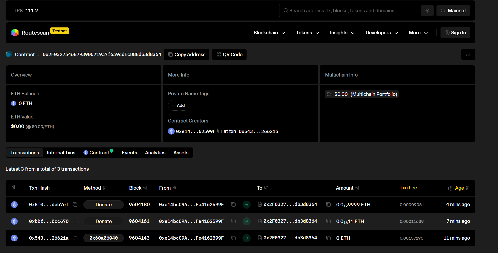
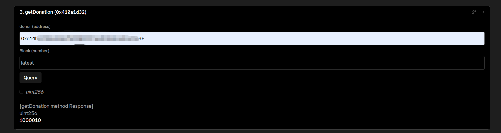

📜 合约简介
------------
BeggingContract 是一个用 Solidity 编写的以太坊智能合约，允许用户在限定时间内向合约地址捐赠 ETH。
合约会记录每位捐赠者的累计捐赠金额，并实时维护捐赠排行榜（前 3 名）。
合约所有者可以提取所有捐赠资金。

🧩 功能说明
------------
- 限定捐赠时间（默认部署后 7 天内）。
- 记录每个捐赠者的累计捐赠金额。
- 自动维护前三名捐赠者排行榜。
- 仅合约所有者可以提取资金。
- 每次捐赠会触发 Donation 事件。

⚙️ 函数介绍
-------------
- `donate()`：用户调用该函数捐赠 ETH（仅在允许时间内）。
- `withdraw()`：仅限合约所有者调用，用于提取全部 ETH。
- `getDonation(address)`：查询指定地址的累计捐赠金额。
- `getTop3()`：返回前三名捐赠者的地址和对应金额。

🔐 权限控制
-------------
- 使用 `onlyOwner` 修饰符，确保只有所有者能提取资金。

⏰ 时间限制
-------------
- 捐赠时间从部署时开始计算，持续 7 天。
- 超出该时间范围后，`donate()` 调用将被拒绝。

🚀 部署步骤
-------------
1. 打开 Remix IDE。
2. 将 `BeggingContract.sol` 源码复制粘贴到编辑器。
3. 编译（Solidity 版本 >= 0.8.20）。
4. 连接 MetaMask，选择 Goerli 或 Sepolia 测试网。
5. 部署合约。
6. 使用不同账户调用 `donate()` 测试功能。

🧪 测试方法
-------------
1. 使用多个账户分别调用 `donate()`，发送不同数量的 ETH。
2. 调用 `getDonation(address)` 查询累计金额。
3. 调用 `getTop3()` 查看排行榜是否正确。
4. 用非所有者账户尝试 `withdraw()`（应失败）。
5. 用所有者账户调用 `withdraw()` 提取所有捐赠。
6. 确认合约余额清零。

🧩 合约信息
------------
- **合约地址**：`0x2F0327a468793906719a7f6a9cdEcD8Bdb3d8364`
- **网络**：Sepolia 测试网（Chain ID: 11155111）
- **验证状态**：
  - ✅ [Sourcify Verified](https://repo.sourcify.dev/11155111/0x2F0327a468793906719a7f6a9cdEcD8Bdb3d8364/)
  - ✅ [Routescan Verified](https://testnet.routescan.io/address/0x2F0327a468793906719a7f6a9cdEcD8Bdb3d8364/contract/11155111/code)

------------

📄 开源许可
-------------
本项目基于 MIT License 开源。
